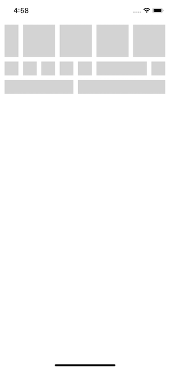

    
    
    

### React Native horizontal date picker

## Npm repo
https://www.npmjs.com/package/@logisticinfotech/react-native-grid

## Git repo
https://github.com/logisticinfotech/react-native-grid

# Guide

<!-- # Installation and Usage
Please check this blog for installation and usage [this link]() -->

## Properties

### Basic

#### For Container

| Prop | Default | Type | Description |
| ------ | -------- | ----- | ------------- |
| height | Screen Height | `Number` | Height of the container. |
| isNested | false | `Bool` | True if Container is nested. |
| backgroundColor | white | `String` | Background color of Container. |
| style | null | `style` | Style of Container. |

#### For Square

| Prop | Default | Type | Description |
| ------ | -------- | ----- | ------------- |
| xSquares | 1 | `Number` | Number of squares you want horizontally.  |
| ySquares | 1 | `Number` | Number of squares you want vertically. |
| backgroundColor | #D3D3D3 | `String` | Background color of Square. |
| allowHeightExcess | false | `Bool` | Allow height access to square or not. |
| fullScreenWidth | false | `Bool` | If you want full screen width grid. |
| style | null | `style` | Style of Square. |
